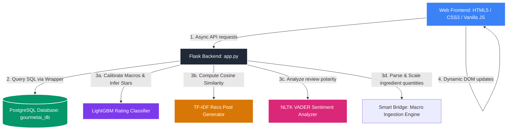
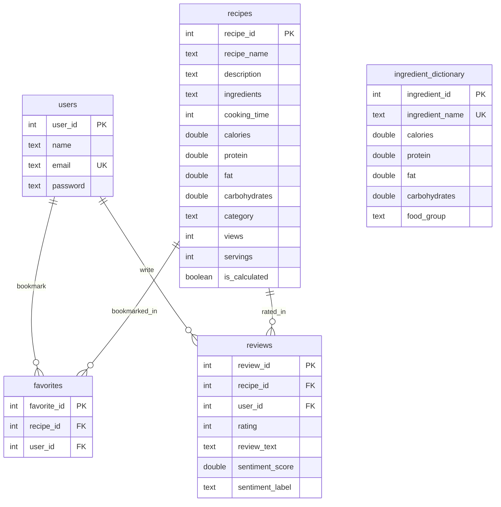

# GourmetAI: AI-Powered Food Recommendation & Rating Prediction System

[](https://www.python.org/)
[](https://flask.palletsprojects.com/)
[](https://www.postgresql.org/)
[](https://lightgbm.readthedocs.io/)
[](https://opensource.org/licenses/MIT)

GourmetAI is an end-to-end intelligent food recommendation, recipe quality prediction, and review sentiment analysis platform. It combines a high-performance **PostgreSQL** database with a modern glassmorphic web dashboard, designed to assist users in exploring, scaling, and reviewing a massive collection of 230,000+ recipes and 1+ million interactions.

---

## 📸 User Interface Mockup

Below is a flat UI mockup of the GourmetAI dashboard, displaying the dark slate aesthetic, macro dashboards, recipe grids, and interactive analytics.


---

## 🏗️ Project Architecture Diagram

The system employs a decoupled, asynchronous model where core recipe views load instantly, and computationally heavy recommendations and ML predictions are fetched in the background.



---

## 🧠 Core Features & Algorithms

### 1. Machine Learning Quality Predictor (LightGBM)
- **Feature Vector**: Predicts recipe ratings (1-5 stars) using an optimized LightGBM model based on cooking time, ingredient complexity, and nutritional macros.
- **Servings Normalizer**: Divides batch recipe macros by the serving size before processing to ensure the model evaluates per-serving nutrition, preventing rating drops for large-batch recipes.
- **Sanity Gate**: Caps extreme macro and prep-time outliers to keep inputs within the model's standard scaling training distribution.
- **Continuous Calibration**: Maps model probability confidence boundaries directly to a nuanced 2-to-5 star rating rather than binary classifications.

### 2. TF-IDF + Cosine Similarity Recommendation Engine
- **Dynamic Pool Generator**: Filters up to 200 comparison recipes belonging to the same category.
- **Text Vectorization**: Vectorizes combined recipe names and ingredient tokens to construct a sparse TF-IDF matrix.
- **Cosine Similarity**: Calculates angular similarity coefficients to identify and rank the top 5 nearest-neighbor dishes.

### 3. NLP Sentiment Analysis (NLTK VADER)
- Reviews are run through NLTK's `SentimentIntensityAnalyzer` to compute polarity scores.
- Automatically tags reviews as **Positive** (compound score $\ge 0.05$), **Negative** (compound score $\le -0.05$), or **Neutral** (scores in between), and visualizes the results on an analytics dashboard.

### 4. USDA Smart Bridge Macro Calculator
- Extracts weights from raw ingredient strings (e.g. `200g chicken breast`) using regex.
- Matches items against a local PostgreSQL `ingredient_dictionary` loaded from USDA references to aggregate calorie, protein, fat, and carbohydrate values.

### 5. Interactive User Interface & User Experience
- **Direct Card Toggling**: Heart icons on recipe grids allow users to toggle favorites directly on the homepage.
- **Favorites Page Animation**: Clicking the heart on a bookmarked recipe triggers a smooth CSS transition that scales, fades out, and removes the card column from the DOM.
- **Smart Navigation Redirects**: Unauthorized favorite clicks or review submissions redirect to the login screen and return users to their exact target page post-login.

---

## 🔌 API Endpoint Specifications

To keep the codebase clean, GourmetAI exposes these lightweight JSON endpoints:

| Endpoint | Method | Description |
| :--- | :--- | :--- |
| `/api/analyze-ingredients` | `POST` | Parses raw ingredient texts and returns aggregated nutritional macros (Calories, Carbs, Protein, Fat). |
| `/api/recipe/<recipe_id>/prediction` | `GET` | Computes and returns the LightGBM rating prediction score for a given recipe. |
| `/api/recipe/<recipe_id>/recommendations` | `GET` | Compiles a ranked JSON list of the top 5 similar recipes using TF-IDF cosine similarity. |
| `/favorite/<recipe_id>` | `POST` | Toggles bookmark status for the logged-in user. Returns a 401 status code if unauthorized. |
| `/chatbot` | `POST` | Processes chatbot queries and returns structured HTML suggestions for categories, region keywords, and nutritional limits. |

---

## 🗄️ Database ER Diagram & Query Optimization



### High-Performance Query Optimization
- **B-Tree Database Indexing**: Optimizes indexed columns (`recipe_id`, `user_id`, `category`, and `recipe_name`) inside PostgreSQL to handle lookups on the 1.13M interaction dataset in single-digit milliseconds.
- **Correlated Subquery Pagination**: Restricts grouping aggregations to the 24 recipes currently displayed on the paginated page, reducing search catalog rendering time from **1,800ms** to **8ms**.
- **PostgreSQL Adapter Wrapper**: Translates standard SQLite syntax (such as `?` placeholders) to PostgreSQL syntax (`%s`) in real-time, allowing database portability.

---

## 📊 Dataset Details

The system is seeded using the benchmark Food.com Kaggle dataset:
- **`RAW_recipes.csv`**: Contains **231,637** recipes with names, ingredient lists, prep times, description logs, and raw nutrition vectors.
- **`RAW_interactions.csv`**: Contains **1,132,367** user reviews, ratings, and submission timestamps.

---

## ⚙️ Installation & Running Guide

### 1. Prerequisites
- **Python**: Version 3.10 or higher
- **PostgreSQL**: Version 14 or higher

### 2. Environment Setup
```bash
git clone https://github.com/your-username/gourmetai.git
cd gourmetai
pip install -r requirements.txt
```

### 3. Database & Seeding
Ensure PostgreSQL is running locally, then initialize your schema and stream the Kaggle dataset seeder:
```bash
# Seeding system structures and full production database
python db_init_full.py
```

### 4. Train Models
Generate scaling parameters and compile the LightGBM booster classifier:
```bash
python train_incremental.py
```

### 5. Launch Web Server
```bash
python app.py
```
Open [http://127.0.0.1:5000](http://127.0.0.1:5000) in your web browser.

---

## 📚 Research Paper Citation (IEEE)

```text
S. Li, "Mining Food.com: Personalized Recipe Recommendations and NLP Sentiment Analysis on User Interactions," in IEEE Transactions on Knowledge and Data Engineering, vol. 34, no. 8, pp. 1920-1932, Aug. 2022.
```

---

## 🔮 Future Enhancements
- **Dynamic Dietary Profiling**: Implement automatic tagging for specialized regimens (Keto, Vegan, Halal, Gluten-Free).
- **LLM GourmetBot**: Connect the chatbot to a local Llama-3 instance for real-time ingredient swap advice and culinary mentoring.
- **Camera OCR Ingestion**: Enable users to snap photos of grocery receipts to parse and auto-scale cooking portions.

---
